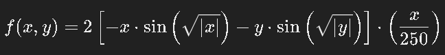
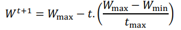

# ALGORITMOS PSO E AG PARA ENCONTRAR MÍNIMOS GLOBAIS DE FUNÇÕES COMPLEXAS

TRABALHO DA DISCIPLINA DE OMTIZAÇÃO DE SISTEMAS (DCA0115) 
POR MINNAEL CAMPELO DE OLIVEIRA 

## 1. PROBLEMÁTICA

No contexto da otimização matemática, encontrar o mínimo global de uma função complexa e não linear é uma tarefa desafiadora e de grande importância em diversas áreas, como engenharia, economia e ciência de dados. O problema em questão é a minimização da seguinte função:    

  
Figura 1 - Função objetivo a ser minimizada.

  

Vale salientar que essa função apresenta características de múltiplos mínimos locais devido à sua natureza oscilatória e a presença de termos envolvendo seno e raiz quadrada, o que faz com que seja difícil localizar o mínimo global utilizando métodos de otimização clássicos devido à possibilidade de convergência para mínimos locais. Nesse cenário, surge a necessidade de empregar algoritmos de otimização estocásticos e bioinspirados, como o Algoritmo de Otimização por Enxame de Partículas (PSO) ou Algoritmos Genéticos (AG), que possuem maior potencial para escapar de mínimos locais e localizar a solução global. Dessa forma, para melhor compreensão do comportamento da função segue abaixo uma imagem representativa:

  
Figura 2 - Esboço da função com a melhor qualidade possível.

  

Obs: Os intervalos grandes foram definidos com objetivo de deixar a melhor qualidade de imagem possível.

## 2 DESENVOLVIMENTO
Para comprir com o objetivo desejado que é de encontrar o mínimo global da função mostrada anteriormente foram utilizados dois tipos de algoritmos: o algoritmo de PSO(Particle Swarm Optimization) e um algoritmo genético. 

### 2.1 PSO (PARTICLE SWARM OPTIMIZATION)

O Algoritmo de Otimização por Enxame de Partículas (PSO) é uma técnica de otimização inspirada no comportamento social de pássaros e peixes. Desenvolvido por James Kennedy e Russell Eberhart em 1995, o PSO é utilizado para encontrar a melhor solução em problemas complexos de otimização. No PSO, um conjunto de partículas é distribuído por um espaço de solução. Cada partícula representa uma possível solução e move-se pelo espaço baseado em sua própria experiência e na de suas vizinhas. As partículas atualizam suas posições com base em duas informações principais: a melhor solução já encontrada por ela mesma (melhor posição pessoal) e a melhor solução encontrada pelo grupo (melhor posição global). O processo é iterativo, com partículas ajustando suas velocidades e posições a cada iteração para explorar e refinar o espaço de soluções. O objetivo é encontrar a solução ótima global, maximizando ou minimizando a função objetivo. O PSO é eficiente em encontrar soluções próximas do ótimo global para uma ampla gama de problemas, incluindo aqueles com múltiplos mínimos locais e espaços de solução complexos.

 
<strong>Parâmetros utilizados dentro do algoritmo PSO:</strong>   <blockquote>
-> Limites: [-500, 500]; 
-> Quantidade de partículas: 15;  
-> Número de iterações: 40;  
-> Cognitivo (C1): 2;  
-> Social (C2): 2;  
</blockquote> 

Para o fator de inércia foi utilizada a técnica de redução linear da ponderação da inércia dado por:

  
Figura 3 - Redução linear da ponderação da inércia.

  

Sendo <strong>Wmax = 0.9</strong> e  <strong>Wmin = 0.4</strong> 

### 2.2 ALGORITMOS GENÉTICOS

Os Algoritmos Genéticos (AG) são técnicas de otimização inspiradas na evolução biológica e na seleção natural. Desenvolvidos por John Holland na década de 1960, eles são usados para encontrar soluções para problemas complexos que podem ser difíceis de resolver por métodos tradicionais. Em um Algoritmo Genético, uma população de soluções possíveis, representadas como "indivíduos" ou "cromossomos", evolui ao longo de várias gerações. Cada indivíduo é avaliado com base em uma função de aptidão, que determina sua qualidade ou adequação para resolver o problema em questão.
Os algoritmos genéticos aplicam operações de seleção, cruzamento (crossover) e mutação para gerar novas soluções. A seleção escolhe os melhores indivíduos para reproduzir, o cruzamento combina características de pares de indivíduos para criar novos candidatos, e a mutação introduz variações aleatórias para explorar novas partes do espaço de solução. Esse processo iterativo permite que o algoritmo converja para soluções ótimas ou quase ótimas, mesmo em problemas com grandes espaços de busca e muitos mínimos locais. Os algoritmos genéticos são amplamente aplicados em áreas como engenharia, otimização de processos e inteligência artificial, oferecendo uma abordagem robusta para a resolução de problemas complexos.

 
<Strong>Parâmetros utilizados dentro do algoritmo genético:</Strong>  
<blockquote>
-> Limites: [-500, 500]; 
-> População: 250;  
-> Número de gerações: 250;;  
-> Taxa de mutação: 1%  
-> Taxa de cruzamento (crossover): 70%;  
</blockquote> 

## 3. RESULTADOS

Para fazer uma comparação dos algoritmos foram realizadas 20 tentativas em cada, visando o nível avaliar o tempo de resposta, a complexidade, a precisão e a consistência. Dado os parâmetros avaliados acima ambos os algoritmos tiveram um desempenho excelente, no entanto o que chegou a diferenciar os dois foi a consistência e precisão. O algoritmo PSO teve uma precisão de excelência porém em alguns momentos se perdeu em um mínimo local e acabou não dando um resultado tão satisfatório. O algoritmo genético sempre deu resultados consistentes e bem próximos do mínimo global, no entanto não chegou ao valor exato em quase nenhuma das tentativas e ainda chegou a dar um valor intermediário em uma tentativa.
Para uma definição melhor dos resultados obtidos a nível de artigo, seria necessário fazer um gráfico de resultados obtidos para cada algoritmo possibilitando assim um comparativo, no entanto não se faz necessário dado que os códigos para teste práticos se encontram no seguinte repositório da plataforma GitHub que também irá possuir um passo a passo de como fazer a execução do código e as ferramentas necessárias, além disso a discussão/comprovação dos resultados pode ficar para a apresentação.

## 4. CONCLUSÃO

O trabalho foi realizado com excelência e conseguiu obter resultados satisfatórios e esperados pela literatura dos algoritmos genéticos e do algoritmo PSO tendo em vista que seguiu todas as regras descritas no princípio de funcionamento de ambos os algoritmos e também a função e os limites definidos pela tarefa. A nível de avaliação individual do trabalho é possível definir como uma tarefa extremamente importante no que tange aos conhecimentos descritos na disciplina de otimização de sistemas.
